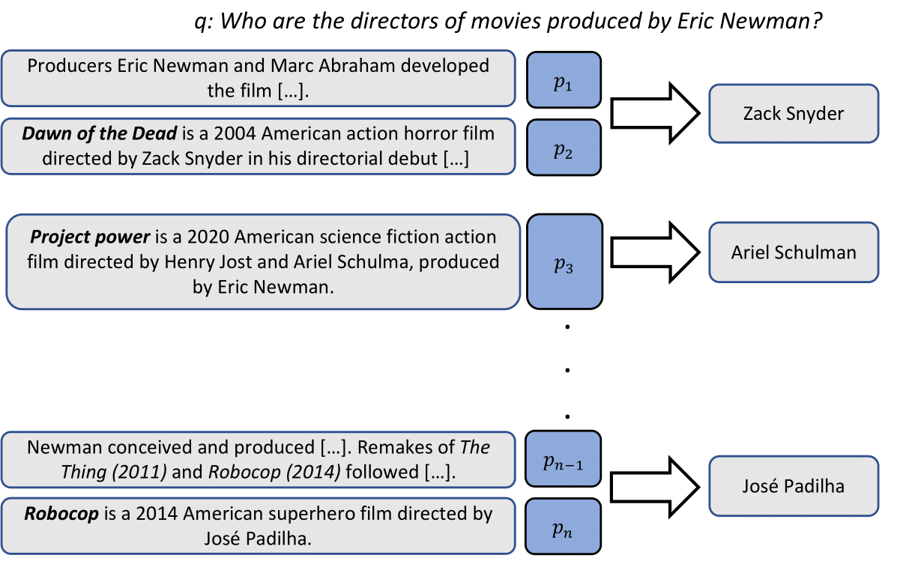

## QAMPARI: Question Answering over Multiple PARagraphs Indeed 

Can your QA system answer 'Who was drafted by the Brooklyn Nets?' or tell us 'which movies did Eric Newman ever produce?' Now you can challenge your systems to do just that!
Introducing QAMPARI an Open Domain Question Answering dataset with Many answers indeed! Unlike most Open Domain QA tasks,
each question in QAMPARI has at least five different answers. You can use QAMPARI's training set of 61,911 generated examples
to train multi-answer QA models over Wikipedia. We also provide development and test sets of 1,000 examples each. Questions
in our evaluation set were composed by human annotators. Using QAMPARI you can now evaluate your Open Domain QA systems for multi-answer questions answering!  
This dataset was released by researchers from Tel Aviv University.

    

##  Download 

You can follow <a href="https://aggreg-qa.s3.amazonaws.com/qampari.zip">this</a> link to download a zipped file with the train, dev and test data.
